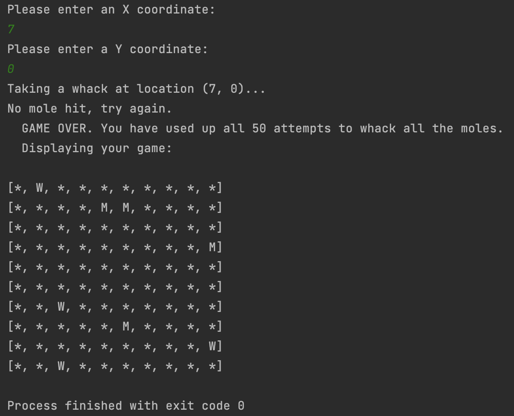

# Whack-A-Mole

The traditional arcade game, coded up in Java (JDK 18).

### Welcome
<p align="center">
  
</p>

### Display Grid after First Mole Hit
<p align="left">
  &emsp;&emsp;&ensp;
  
</p>

### Surrendering
<p align="left">
  &emsp;&emsp;&ensp;
  
</p>

### Game Over
<p align="left">
  &emsp;&emsp;&ensp; 
  
</p>

### Inputting Wrong Coordinates
<p align="center">
  
</p>

### User Wins
<p align="left">
  &emsp;&emsp;&ensp; 
  
</p>

## Installation
- Run in IntelliJ:
  1. Clone this repo and open the project in (JetBrains') IntelliJ IDEA
  2. Set the JDK to 18 (download it first if you don't have it already)
  3. Run `src/com/example/whackamole/WhackAMole.java`
- Run in VS Code:
  1. Install "Extension Pack for Java" from VSCode packages
  2. Install a JDK (e.g. [Eclipse Temurin 11.0.15+10](https://adoptium.net/temurin/releases/?version=11))
  3. Run `src/com/example/whackamole/WhackAMole.java`

## Code Features / How to Play:
- The user has 50 attempts to whack all 10 hidden moles in the 10x10 grid.
- Each turn, the user is prompted to enter an X- and Y-coordinate of the grid where they would like to whack.
- If their guess/whack is correct, the number of moles left to whack are reduced and the user is prompted for their next move.
- If their guess/whack is incorrect, their attempts left are reduced and they're re-prompted for their next move.
- The user can enter the coordinates of (-5,-5) to see their progress: the entire grid and where they've successfully whacked a mole.
- The user can enter the coordinates of (-1,-1) to surrender, which will end the game and reveal the entire grid and where the remaining, and whacked, moles are.

## Game Script
```java
public class WhackAMole {
    int score;
    int molesLeft;
    int attemptsLeft;
    char[][] moleGrid;

    public WhackAMole(int numAttempts, int gridDimension) {
        ...
    }

    public boolean place(int x, int y) {
        /*
         * Given a location (X, Y), place a mole at that location.
         * Also update number of moles left.
         */
        ...
    }

    public void whack(int x, int y) {
        /*
         * Given a location, take a whack at that location. If that location
         * contains a mole, the score, number of attemptsLeft, and molesLeft
         * are updated. If that location does not contain a mole, only
         * attemptsLeft is updated.
         */
        ...
    }

    public void printGridToUser() {
        /*
         * Print the grid without showing where the moles are.
         * For every spot that has recorded a “whacked mole,”
         * print out a W, and * otherwise.
         */
        ...
    }

    public void printGrid() {
        /*
         * Print entire grid to display the 2d array to the user.
         * Moles are printed as an 'M'. Whacked moles are printed as
         * a 'W'. Cells that don’t have a mole are left as *.
         */
        ...
    }

    public static void main(String[] args) { // "a main method"
        // 1) Instantiate game with number of attempts and grid dimensions
        // 2) Randomly place 10 moles:
        // 3) Allow user to enter X and Y coordinates where they want to whack
        //    Tell them they have a max of 50 attempts to get all moles.
        ...        
    }
}
```

## Code Snippets
#### User input logic
```java
Scanner scanner = new Scanner(System.in);
System.out.println("Please enter an X coordinate: ");
int userInputX = scanner.nextInt();
System.out.println("Please enter a Y coordinate: ");
int userInputY = scanner.nextInt();
if (userInputX == -1 && userInputY == -1) {
    System.out.println("User surrendered. Displaying entire grid:");
    game.printGrid();
    break;
} else if (userInputX == -5 && userInputY == -5) {
    System.out.println("Displaying your game progress. 'W' is where you've successfully whacked a mole!");
    game.printGridToUser();
} else if (userInputX > 9 || userInputX < -1 || userInputY > 9 || userInputY < -1
) {
    System.out.println(String.format("""
            Coordinates go from (0,0) to (9,9). Or (-1,-1) to surrender and (-5,-5) to display your progress grid. 
            Your input (%1$s, %2$s) was out of bounds. 
            Please try again.
            """, userInputX, userInputY));
} else {
    System.out.println(String.format("Taking a whack at location (%1$s, %2$s)...", userInputX, userInputY));
    game.whack(userInputX, userInputY);
    if (game.molesLeft == 0) {
        break;
    }
}
```
#### Setting up a new game (randomly placing 10 moles)
```java
public static void main(String[] args){
    ...
    Random randomInst=new Random();
    int coords=0;
    for(coords=0;coords<gridDims; coords++){
        int randomX=randomInst.nextInt(gridDims);  // range: [0,9]
        int randomY=randomInst.nextInt(gridDims);
        game.place(randomX,randomY);
    }
}
```

```java
public boolean place(int x, int y) {
    if (moleGrid[x][y] != 'M') {
        moleGrid[x][y] = 'M';
        
        int numberOfMoles = 0;
        for (int row = 0; row < moleGrid.length; row++) {
            for (int col = 0; col < moleGrid.length; col++) {
                if (moleGrid[row][col] == 'M') {
                    numberOfMoles++;
                }
            }
        }
        molesLeft = numberOfMoles;
        return true;
    } else {
        return false;
    }
}
```
