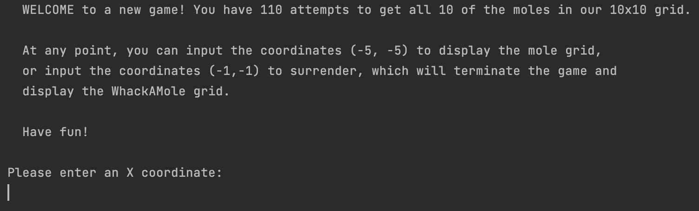

# Whack-A-Mole

The traditional arcade game, coded up in Java (JDK 18).

### Welcome

  

### Display Grid

  &ensp;&ensp; 
  

### First Mole Hit

  &ensp;&ensp; 
  

### Surrendering

  &ensp;&ensp;  
  

### Game Over

  &ensp;&ensp; 
  

## Installation
- Run in IntelliJ:
  1. Clone this repo and open the project in (JetBrains') IntelliJ IDEA
  2. Set the JDK to 18 (download it first if you don't have it already)
  3. Run `src/com/example/whackamole/WhackAMole.java`
- Run in VS Code:
  1. Install "Extension Pack for Java" from VSCode packages
  2. Install a JDK (e.g. [Eclipse Temurin 11.0.15+10](https://adoptium.net/temurin/releases/?version=11))

## Code Features / How to Play:
- The user has 50 attempts to whack all 10 hidden moles in the 10x10 grid.
- Each turn, the user is prompted to enter an X- and Y-coordinate of the grid where they would like to whack.
- If their guess/whack is correct,... 
- The user can enter the coordinates of (-5,-5) to see their progress: the entire grid and where they've successfully whacked a mole.
- The user can enter the coordinates of (-1,-1) to surrender, which will end the game and reveal the entire grid and where the remaining, and whacked, moles are.

## Code Snippets

